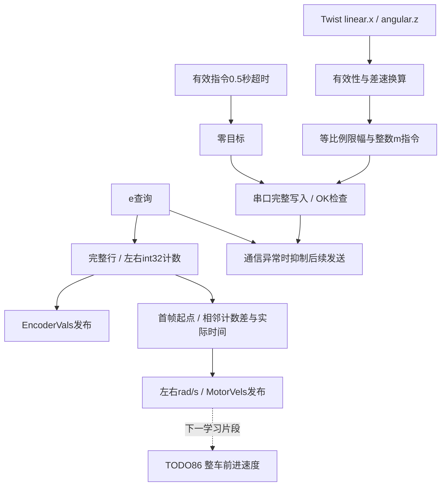

# serial_motor 当前流程

```mermaid
flowchart TD
  A[Twist linear.x / angular.z] --> B[有效性与差速换算]
  B --> C[等比例限幅与整数m指令]
  C --> D[串口完整写入 / OK检查]
  E[有效指令0.5秒超时] --> F[零目标]
  F --> D
  G[e查询] --> H[完整行 / 左右int32计数]
  H --> I[EncoderVals发布]
  H --> J[首帧起点 / 相邻计数差与实际时间]
  J --> K[左右rad/s / MotorVels发布]
  D --> L[通信异常时抑制后续发送]
  G --> L
  K -. 下一学习片段 .-> M[TODO86 整车前进速度]
```

此图只描述当前源码职责。TODO86 尚未实现/接入；真实数据与停止证据以训练记录为准，图不替代运行验收。
